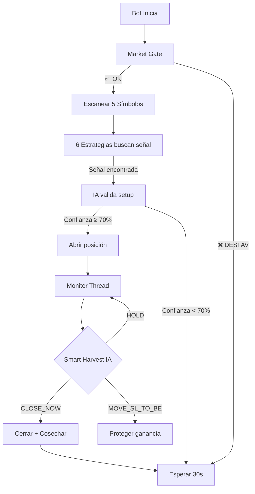

# 🤖 Trading AI Bot — Binance Futures

> Bot de trading automatizado con arquitectura limpia, análisis de IA (OpenAI), y modo **Flash Growth** para crecimiento agresivo con capital limitado.

---

## ⚡ Características Principales

### 🧠 Inteligencia Artificial Integrada
- **Validación de Señales**: Cada señal técnica es evaluada por OpenAI antes de ejecutar el trade (confianza ≥ 70%)
- **Smart Harvest**: La IA analiza posiciones abiertas con **contexto técnico completo** (ADX, RSI, tendencia) y recomienda acciones inteligentes:
  - `CLOSE_NOW` — Cierra si la tendencia muere (ADX < 25) o PnL < -4%
  - `MOVE_SL_TO_BE` — Mueve Stop Loss a Break-Even si PnL > 0.3%
  - `REDUCE_RISK` — Reduce riesgo si PnL negativo con ADX cayendo
- **Market Insight**: Análisis periódico del sentimiento de mercado por la IA
- **Selección Dinámica de Símbolos**: La IA elige los mejores pares para operar basándose en volatilidad y puntuación técnica

### 📈 6 Estrategias de Trading Activas
| Estrategia | Timeframe | Tipo |
|---|---|---|
| **EMA Trap** | 5m | Rebotes en tendencia (EMA 9/21) |
| **ZS 5m** | 5m | Reversión en Pivot Points |
| **ZS 1m** | 1m | Scalping rápido en zonas de soporte/resistencia |
| **VWAP OrderFlow** | 5m | Flujo institucional (VWAP + volumen) |
| **Liquidation Cascade** | 5m | Cascadas de liquidaciones |
| **Trend Anticipator** | 15m | Predicción de tendencia (BOS + estructura) |

### 🚀 Modo Flash Growth (Crecimiento Agresivo)
Diseñado para crecer rápidamente con **$100 USDT** de capital:
- **Sizing Dinámico**: 30% del capital virtual por trade
- **Apalancamiento Inteligente**: 15x base, **20x** cuando la IA tiene > 90% confianza
- **Break-Even Agresivo**: SL se mueve al precio de entrada cuando ROI ≥ 0.25%
- **Cosecha Rápida**: Cierra 75% en TP1, deja el resto correr

### 🌍 Market Gate (Filtro de Condiciones)
Antes de abrir cualquier posición, el bot verifica:
- ✅ BTC momentum 4h (mínimo ±0.8%)
- ✅ ADX promedio ≥ 20 (tendencia suficiente)
- ✅ Funding rate normal (< 0.08%)
- ✅ Horario de trading activo (evita 20:00-23:59 UTC)

### 📧 Notificaciones por Email
- **Bot Iniciado**: Confirmación con símbolos activos
- **Trade Abierto**: Dirección, estrategia, entrada, SL, TP, nocional, R:R
- **Trade Cerrado**: PnL en USDT y porcentaje, razón de cierre
- **Resumen P&L**: Cada ~10 min con Win Rate, mejor/peor trade, contexto de mercado (BTC/ADX), y decisiones de la IA
- **Decisión IA (Smart Harvest)**: Tabla con ADX, RSI, tendencia y acción por posición
- **Análisis Diario**: BTC momentum, ADX, funding, predicción IA

### 🛡️ Gestión de Riesgos
- Stop Loss y Take Profit automáticos por trade
- Trailing Stop Loss dinámico
- Límite de pérdidas consecutivas (max 3)
- Break-Even agresivo a +0.25% ROI
- Cooldown entre trades por símbolo (5 min)

---

## 🏗️ Arquitectura

```
trading_bot/
├── run_refactored.py          # Punto de entrada
├── src/
│   ├── domain/                # Lógica de negocio pura
│   │   ├── models.py          # Signal, Position, OrderSide, SessionStats
│   │   ├── strategies.py      # 6 estrategias de trading
│   │   └── risk_manager.py    # TP/SL, trailing, break-even
│   ├── application/           # Casos de uso
│   │   ├── interfaces.py      # Contratos abstractos (ports)
│   │   └── use_cases.py       # TradeExecutor, PositionManager, TradingBotApp
│   ├── infrastructure/        # Implementaciones externas
│   │   ├── binance_service.py # API Binance Futures (con auto-resync)
│   │   ├── openai_adapter.py  # GPT-4o-mini (Smart Harvest + validación)
│   │   ├── email_notifier.py  # SMTP con templates HTML
│   │   └── json_persistence.py# Persistencia de sesión
│   └── adapters/
│       └── cli/main.py        # Configuración e inyección de dependencias
├── Dockerfile                 # Contenedorización
├── docker-compose.yml
├── requirements.txt
└── .env                       # API keys (no versionado)
```

**Patrón**: Clean Architecture (Domain → Application → Infrastructure → Adapters)

---

## 🚀 Inicio Rápido

### Requisitos
- Python 3.10+
- Cuenta Binance Futures (testnet o producción)
- API Key de OpenAI

### Instalación

```bash
# Clonar
git clone https://github.com/tu-usuario/trading-ai-bot-binance.git
cd trading-ai-bot-binance

# Instalar dependencias
pip install -r requirements.txt

# Configurar variables de entorno
cp .env.example .env
# Editar .env con tus API keys
```

### Variables de Entorno (.env)

```env
BINANCE_API_KEY=tu_api_key
BINANCE_API_SECRET=tu_api_secret
OPENAI_API_KEY=tu_openai_key
TRADING_ENV=SANDBOX          # SANDBOX para testnet, LIVE para producción
```

### Ejecutar

```bash
# Localmente
python run_refactored.py

# Con Docker
docker-compose up --build -d
docker logs -f trading_bot
```

---

## 📊 Flujo de Operación



---

## 🔧 Resiliencia

- **Auto-Resync de Tiempo**: Si Binance rechaza un request por timestamp (`APIError -1021`), el bot automáticamente resincroniza con el servidor y reintenta
- **Reconexión de Email**: Fallos de envío no bloquean el bot
- **Manejo de Posiciones Externas**: El bot detecta posiciones abiertas manualmente y les asigna un monitor thread
- **Warmup Period**: 90 segundos de observación al arrancar antes de operar

---

## 📝 Dependencias

| Paquete | Uso |
|---------|-----|
| `python-binance` | API de Binance Futures |
| `openai` | Análisis IA (GPT-4o-mini) |
| `ta` | Indicadores técnicos (ADX, RSI, EMA, VWAP) |
| `pandas` / `numpy` | Procesamiento de datos de mercado |
| `python-dotenv` | Variables de entorno |
| `requests` | HTTP auxiliar |

---

## ⚠️ Disclaimer

Este bot es una herramienta educativa y experimental. **El trading de futuros con apalancamiento conlleva riesgo significativo de pérdida.** No se garantizan ganancias. Úsalo bajo tu propia responsabilidad, preferiblemente en modo testnet primero.

---

## 📄 Licencia

MIT
